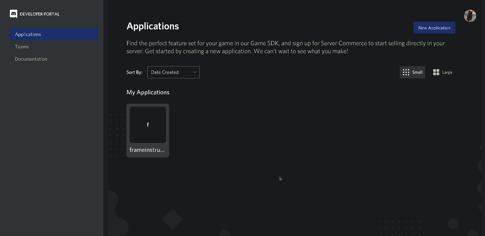
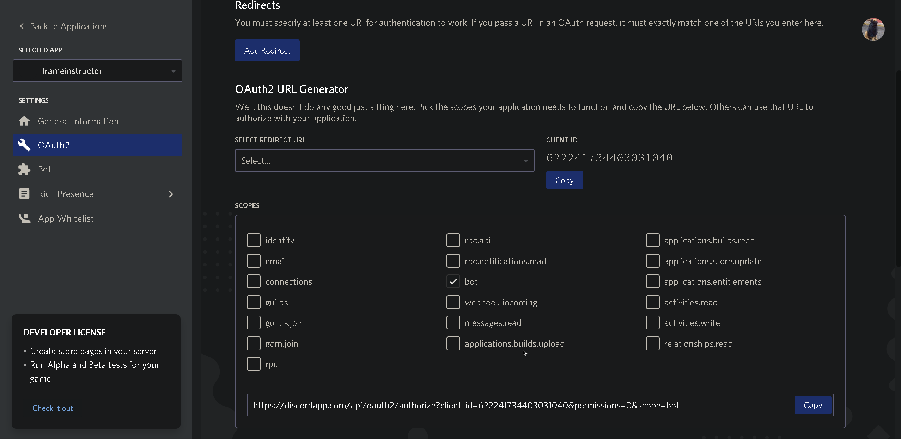
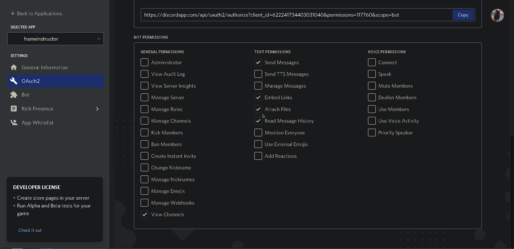
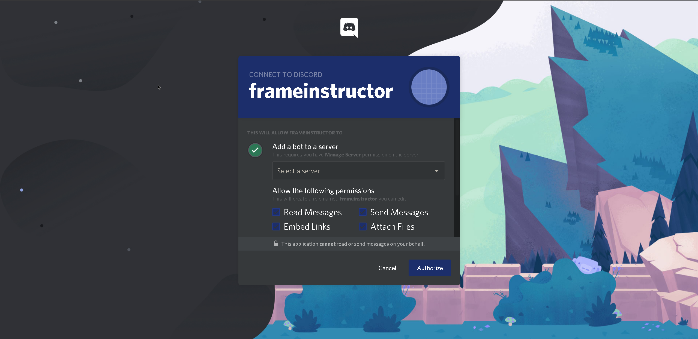

# FrameInstructor

## Description

FrameInstructor is a Discord bot written in Python, the bot is focused around having convenient access to data from the online fighting game Tekken 7. At it's core, FrameInstructor is a program that makes calls to an external API, and uses Discord as a front-end to listen for user input and to return the data of said calls.

## Table Of Contents

- Installation

  - Hosting it

  - Inviting it
  - Dependencies
- Usage
- Acknowledgements
- License

## Installation

### Hosting it

To host FrameInstructor on your machine, you must have a Discord app created, and have a client key to run it with.

`git clone https://github.com/noxlock/FrameInstructor.git`

Move inside the directory, and create a .env file.

`cd FrameInstructor`

`touch .env`

Then, open the .env file in a text editor of your choice

`vim .env`

And paste this into the file:

`CLIENT_KEY=`

After the equals sign, put the client key for your Discord bot account.

`CLIENT_KEY=longstringofstuff`

Save the file and run framebot.py

`python3 ./framebot.py`

If the bot is up and running, it should print something like

`We have logged in as frameinstructor#0300`

If so, you should now refer to the Inviting it section.

NOTE: If you stop the program, the bot will go offline, the process needs to stay running in order to function, I'm using heroku to host it, to avoid leaving my local machine on and running up a power bill.

### Inviting it

If you or someone you know is running the bot, and you'd like to invite it to a server, follow this section.

The person running the bot should be able to head over to Discord's Developer Portal and enter the settings of their application

Click on your application and then head into the OAuth2 settings.

Tick the `bot` box, and then it should bring you down to the bot's permissions.

Select the following options, and then take the link above and paste it into a web browser of your choice.

Select a server, and click authorize.

The bot should now be in the server of your choice, and can be turned on by running 

`python3 ./framebot.py`

At this stage, your bot should be online and in your sever, you're done!

### Dependencies

- Python3
- discord (PyPi)
- requests
- environs

## Usage

## Acknowledgements

## License

​	

