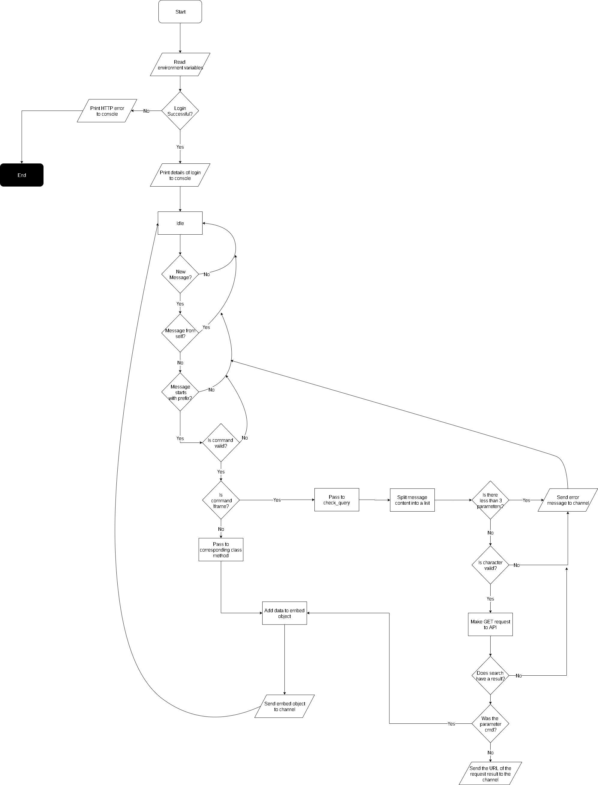

# FrameInstructor

## Description

FrameInstructor is a Discord bot written in Python, the bot is focused around having convenient access to data from the online fighting game Tekken 7. At it's core, FrameInstructor is a program that makes calls to an external API, and uses Discord as a front-end to listen for user input and to return the data of said calls.

## Table Of Contents

- [Algorithm](https://github.com/noxlock/FrameInstructor#algorithm)
- [Installation](https://github.com/noxlock/FrameInstructor#installation)
  - [Hosting it](https://github.com/noxlock/FrameInstructor#hosting-it)
  - [Inviting it](https://github.com/noxlock/FrameInstructor#inviting-it)
  - [Dependencies](https://github.com/noxlock/FrameInstructor#dependencies)
- [Usage](https://github.com/noxlock/FrameInstructor#Usage)
  - [Commands](https://github.com/noxlock/FrameInstructor#commands)
  - [More on !frame](https://github.com/noxlock/FrameInstructor#more-on-frame)
- [Acknowledgements](https://github.com/noxlock/FrameInstructor#Acknowledgements)
- [License](https://github.com/noxlock/FrameInstructor#License)

## Algorithm

When the program is run, FrameInstructor attempts to connect to Discord, and should succeed if you have an internet connection and a valid client token, you'll know if your login succeeds depending on what it prints to console. FrameInstructor will then sit in an idle state, until a message is sent in a channel that it exists in. Upon noticing a message, the bot will perform numerous checks to see if the message is valid, if a statement is false, then the bot will simply return to the idle state.

The first check the bot performs on the message is to see if the author of the message is itself, this prevents it from performing any recursive behaviour. If the message is not sent by itself, then it moves onto the second check, which looks to see if the message starts with the prefix (!), if it does, then it moves onto the third check, which checks if the message matches any of the commands, if this check passes, it determines whether the command it's performing is !frame, or a different command. If the bot determines that it is performing a command different from !frame, it will send it to the respective class methods, and send it to the channel.

If the command supplied is !frame, the bot performs a more detailed process which includes error checking. The error checking begins with the `check_query()` function, which splits the user's message into multiple parts, it then checks how many parts the message has, and that it at least consists of four parts. The bot then formats the message and checks if the character supplied is valid, if this test succeeds then `frame_request()` is called. 

`frame_request()` makes the GET request to the API, and makes sure that the result is correct, it then looks back at what parameters were called with !frame, if it was `cmd`, then it sends it to a class method to be embedded and sent to the channel, if it wasn't `cmd`, then it simply sends the URL of the request to the channel.

 [legend](https://www.smartdraw.com/flowchart/flowchart-symbols.htm)

## Installation

### Hosting it

To host FrameInstructor on your machine, you must have a Discord app created, and have a client key to run it with.

`git clone https://github.com/noxlock/FrameInstructor.git`

Move inside the directory, and create a .env file.

`cd FrameInstructor`

`touch .env`

Then, open the .env file in a text editor of your choice

`vim .env`

And paste this into the file:

`CLIENT_KEY=`

After the equals sign, put the client key for your Discord bot account.

`CLIENT_KEY=longstringofstuff`

Save the file and run framebot.py

`python3 ./framebot.py`

If the bot is up and running, it should print something like

`We have logged in as frameinstructor#0300`

If this seems to be the case, you should now refer to the [Inviting it](https://github.com/noxlock/FrameInstructor#inviting-it) section.

NOTE: If you stop the program, the bot will go offline, the process needs to stay running in order to function, I'm using heroku to host it, to avoid leaving my local machine on and running up a power bill.

### Inviting it

If you or someone you know is running the bot, and you'd like to invite it to a server, follow this section.

The person running the bot should be able to head over to Discord's Developer Portal and enter the settings of their application

Click on your application and then head into the OAuth2 settings.

Tick the `bot` box, and then it should bring you down to the bot's permissions.

Select the following options, and then take the link above and paste it into a web browser of your choice.

Select a server, and click authorize.

The bot should now be in the server of your choice, and can be turned on by running 

`python3 ./framebot.py`

At this stage, your bot should be online and in your sever, the setup is done!

### Dependencies

- Python3
- discord (PyPi)
- requests
- environs

## Usage

The commands for this bot can be found here, or by sending a !help message to the bot.

### Commands

| Command     | Explanation                                                  |
| ----------- | ------------------------------------------------------------ |
| !help       | Displays a help menu that lists of all the possible commands. |
| !help frame | Displays a menu of all the possible syntax to be used with !frame |
| !legend     | Pastes a link to the official Tekken Zaibatsu legend, view this if you don't understand what some acronyms mean. |
| !charlist   | Sends a list of all the possible characters to be used with other commands |
| !frame      | The centrepiece of this bot, sends requests to fANZYo's T7API to retrieve frame data,          and either pastes a link to multiple results, or embeds and sends one result. |

### More On !frame

While all the other commands take no user input and give back something simple, !frame does the opposite, there is a load of possible syntax you can use with this command and that's why it deserves it's own section.

The syntax for !frame can once again be found here, by using !help frame, or by viewing the docs on [fANZYo's T7 API](https://github.com/fANZYo/T7api#parameters). 

#### How To Use It

`!frame character parameter condition ` is the general format of !frame commands, e.g

`!frame noctis plusOnBlock True`

#### Parameters & Conditions

- `plusOnBlock` -> `True/False`
- `plusOnHit` -> `True/False`
- `plusOnCounter` -> `True/False`
- `minusOnBlock` -> `True/False`
- `minusOnHit` -> `True/False`
- `minusOnCounter` -> `True/False`
- `onBlock` -> `range -> min,max`
- `onHit` -> `range -> min,max`
- `onCounter` -> `range -> min,max`
- `hit` -> `enum { 'h', 'm', 'l' }` 
- `firstHit` -> `enum { 'h', 'm', 'l' }`
- `lastHit` -> `enum { 'h', 'm', 'l' }`
- `speed` -> `range -> min,max`
- `crush` -> `enum { 'TC', 'TJ' }` 

## Acknowledgements

[fANZYo](https://github.com/fANZYo) for providing the T7API, which !frame makes all it's requests to.

## License

This program is under the MIT License, check LICENSE.md for more information.	

